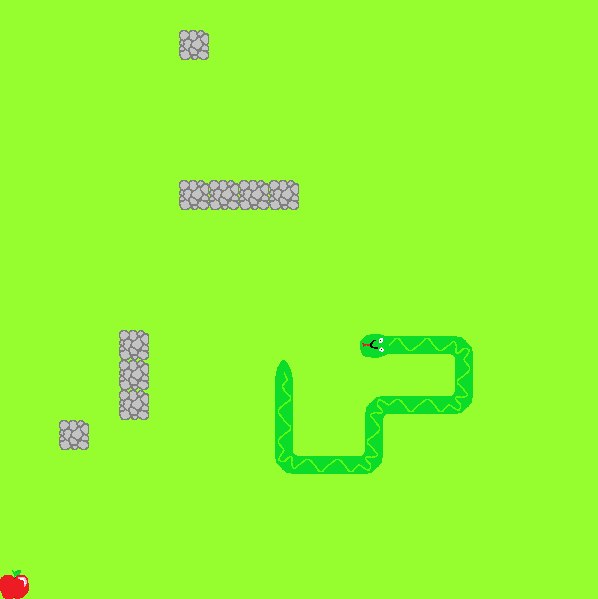

# Snake Game



## Table of Contents
1. [Introduction](#introduction)
2. [Features](#features)
3. [Installation](#installation)
4. [How to Play](#how-to-play)
5. [License](#license)
6. [Contact](#contact)

## Introduction
Snake game is a simple game where you steer snake to eat apples to grow longer and avoid walls, obsticles and your own body to stay alive.

## Features
- Three different game difficulties.
- Saving scores with your name.

## Installation
Follow these steps to set up and run the Snake Game on your local machine:

1. **Clone the repository**
    ```bash
    git clone https://zts.ita.pwr.wroc.pl/gitlab/mateusz.majewski_278292/snake_mw_cz09_278292.git
    ```

2. **Navigate to the project directory**
    ```bash
    cd snake_mw_cz09_278292
    ```

3. **Install sfml if you don't already have it**
    Depending on your operating system instalation process may vary, feel free to chech it out yourself.
    If you're useing Ubuntu or Debain, open terminal and write down these comands:
    ```bash
    sudo apt update
    sudo apt install libsfml-dev

    ```

4. **Compile program**
    Depending on youre code editor it may vary, here I use Clion or Makefile.
    Compilation for Makefile:
    ```bash
    make
    ```

5. **Run the game**
    ```bash
    make run
    ```

## How to Play
- Select game mode you want to play, it will be shown by pressed button.
- Use WASD keys to control the direction of the snake.
- Eat apples to grow longer.
- Avoid running into the walls or the snake's own body.
- If you loose, write down your name and click Enter.
- You can see top 10 scores by clicking on the SCORE button.


## License
All files including graphics were made by the creator of the project specificaly for its use.
This project is licensed under the MIT License - see the [LICENSE](LICENSE) file for details.

## Contact
If you have any questions or suggestions, feel free to contact me at [278292@student.pwr.edu.pl].
